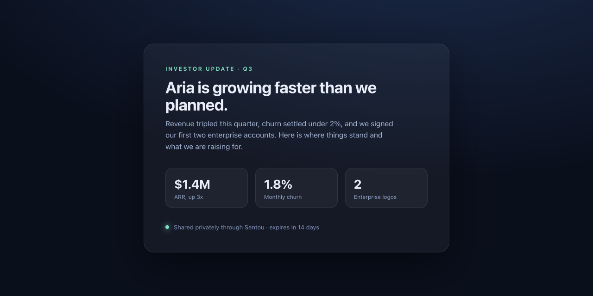
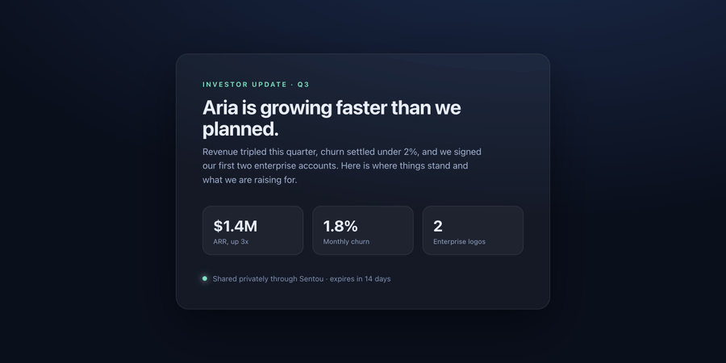

<p align="center">
  
</p>

[](https://github.com/TrueLineCollective/sentou/actions/workflows/ci.yml)
[](./LICENSE)

<p align="center">
  
</p>

Sentou publishes a Claude artifact, or any HTML, to a private link you control. You decide who can open it. You keep editing in place, and the link never breaks. Everything runs on your own infrastructure, so the document and the list of people who opened it stay on a server you own.

Sharing something you made in Claude usually means one of two compromises: drop it at a public URL and hope it stays put, or hand it to a platform whose business is tracking who reads your work. Sentou is the alternative to both.

<p align="center">
  
  <br /><sub>Publish once, then keep editing in Claude. The link stays the same.</sub>
</p>

This is early. The core works and is covered by tests, but a good part of the roadmap below is still ahead. I build it in the open and keep this page honest about what is shipped and what is still planned.

## What it does today

- Publish an artifact or raw HTML to a link, over the HTTP API or from inside Claude through the MCP server.
- Edit in Claude and republish to the same link. The URL stays put and everyone who already has it keeps access. The link follows your latest version instead of freezing a copy.
- Control who gets in: require an email, restrict to a company domain, set an expiry, or revoke a link when you are done.
- See who opened a link, when, and how long they stayed, if you turn it on. Tracking is off by default and opt-in per link (`track: true` at publish). When it is on, the viewer tells the recipient the link records their visit, and you read the totals back from `/api/stats`.
- Every artifact runs sandboxed. It loads in an isolated, opaque origin (an `allow-scripts` iframe with no same-origin access, backed by a `sandbox` directive on the bytes themselves), so its JavaScript stays interactive but cannot reach the cookies, session, or data on your domain. That holds even when someone opens the raw artifact URL directly, not only inside the viewer.

How hard the email gate locks depends on whether you wire an email sender. Set `SENTOU_RESEND_KEY` and `SENTOU_EMAIL_FROM` and a verifying gated link emails a one-time code to the address someone types and only grants access once they enter it back. The email is then verified, the domain allowlist riding on it becomes a real lock, and that verified address is the only kind Sentou ever stores. Without verification the email is access friction, not identity: a gated link asks for an address and enforces expiry and revocation, but does not confirm or store it, so a typed email is a key for that session, not a record. In that mode the unguessable link, expiry, and revoke are the real controls, and they hold no matter what email someone enters.

## How the sandbox works

A Sentou artifact is arbitrary HTML and JavaScript that other people load in their own browsers. That is a real attack surface, and it is the part that took the most care to get right. The artifact is served with a `sandbox allow-scripts` directive in its `Content-Security-Policy` and rendered inside an `allow-scripts` iframe with no `allow-same-origin`. The CSP also permits inline and `eval`'d scripts and HTTPS resources, because the artifact needs to run its own code; the load-bearing isolation is the `sandbox` directive, not those source lists. The scripts still run, so the artifact stays interactive, but the browser hands them an opaque origin with no path back to the parent page or its data. The access check sits at the route that serves the bytes, not only in the page that frames them, so editing the URL does not get past the gate.

What the sandbox does not do is stop the artifact from talking to the outside world. Like any web page, its own JavaScript can make network requests. The opaque origin protects your site and your other links from the artifact, not the artifact's own traffic, so treat a published artifact like code you are choosing to run: only publish ones you trust.

## Privacy and data

Sentou stores as little as it can, on infrastructure you control. Here is exactly what lands on disk:

- **The artifact** and each version you republish.
- **For a gated link with `verifyEmail` on**, the verified email of each viewer. A gate without verification asks for an email as access friction but does not store it. Sentou never persists an address it has not verified.
- **For a tracked link**, an open event per visit (timestamp and dwell time), attributed to a verified viewer's email or to `anon` otherwise.

It all lives in one JSON file at `SENTOU_DB`, in plaintext. There is no telemetry and nothing is sent anywhere off your server. Protect that file the way you would any file of personal data: restricted permissions, and disk encryption on an exposed host. Set `SENTOU_RETENTION_DAYS` to prune viewer and event data older than a window, and use `/api/forget` to erase a link's data, or one viewer's, on request.

## Quickstart (self-host)

Requires Node 20.9 or newer and Git.

```bash
git clone https://github.com/TrueLineCollective/sentou.git
cd sentou
npm install
echo "SENTOU_SECRET=$(openssl rand -hex 32)" > .env.local   # signs access cookies; skip it locally and a random per-process key is used (dev sessions reset on restart)
npm run dev
```

Publish something:

```bash
curl -s -X POST localhost:3000/api/publish \
  -H 'content-type: application/json' \
  -d '{"html":"<h1>hello</h1>"}'
# -> { "id": "...", "slug": "...", "url": "http://localhost:3000/v/...", "version": 1 }
```

Open the `url` it returns to see your artifact in its sandbox. To update it, POST `{ "id": "...", "html": "..." }` to `/api/republish` and the same link picks up the change.

To gate a link, pass `requireEmail`, `allowedDomains`, or `expiresAt` at publish time. A gated link asks for an email before it loads, and `/api/revoke` shuts it off.

To turn the email gate into a real boundary, pass `verifyEmail: true` at publish time and configure an email sender by setting `SENTOU_RESEND_KEY` (a [Resend](https://resend.com) API key) and `SENTOU_EMAIL_FROM` (the verified from-address). A verifying link emails a one-time code and only grants access once the recipient enters it. Leave the sender unset and verification falls back to logging the code to the server console, which is useful for local testing but is not a boundary.

### Publishing from Claude

Sentou ships an MCP server, so you can publish without leaving a Claude session. `claude mcp add` stores the command globally, so use an **absolute path** to `mcp/server.ts`, otherwise the server fails to start whenever you open Claude from another directory. Run this from the repo root (with `npm run dev` already running so there is an instance to publish to); `$(pwd)` bakes in the absolute path:

```bash
claude mcp add sentou -- npx tsx "$(pwd)/mcp/server.ts"
```

Claude gets two tools, `publish_artifact(html)` and `republish(id, html)`. If your instance is not on localhost, or you have set an owner token, pass both through the MCP server's environment, otherwise a hardened instance answers the publish call with a bare `401`:

```bash
claude mcp add sentou \
  --env SENTOU_URL=https://sentou.yourdomain.com \
  --env SENTOU_OWNER_TOKEN=your-owner-token \
  -- npx tsx "$(pwd)/mcp/server.ts"
```

## Deploying

`npm run dev` is for local work, not the internet. Sentou keeps its data in a single JSON file on local disk, so run it as **one instance with a persistent volume**. Do not deploy it to a serverless or autoscaling platform (Vercel Functions, multi-replica containers): each instance would get its own store and your links would scatter across them. One container, one disk.

The store reads and rewrites that whole JSON file on each change. That is fine for personal and team scale (dozens of links, thousands of events) and keeps the dependency surface at zero, but it is not built for high traffic. Heavy, multi-tenant volume is what the hosted tier is for. Put a reverse proxy you control (Caddy, nginx, your platform's ingress) in front for TLS and so the per-IP rate limiting can trust its client address.

### With Docker

```bash
export SENTOU_SECRET=$(openssl rand -hex 32)
export SENTOU_BASE_URL=https://sentou.yourdomain.com
export SENTOU_OWNER_TOKEN=$(openssl rand -hex 32)
docker compose up -d --build
```

The store lives in the `sentou-data` volume and survives restarts. Put a TLS-terminating reverse proxy (Caddy, nginx, your platform's ingress) in front of it.

### Without Docker

```bash
npm ci && npm run build
SENTOU_SECRET=... SENTOU_BASE_URL=https://... SENTOU_OWNER_TOKEN=... npm run start
```

### Environment for an exposed instance

| Variable | Why |
| --- | --- |
| `SENTOU_SECRET` | Signs and encrypts cookies. In production the app refuses any request that needs it until this is set. Generate with `openssl rand -hex 32`. |
| `SENTOU_BASE_URL` | The public URL links are built from. Left unset, generated links point at `http://localhost:3000`. |
| `SENTOU_OWNER_TOKEN` | Gates the publish, republish, revoke, stats, and forget endpoints. Required in production and whenever `SENTOU_BASE_URL` is a non-localhost host. Send it as `Authorization: Bearer <token>`. |

Optional: `SENTOU_RESEND_KEY` + `SENTOU_EMAIL_FROM` make `verifyEmail` links a real boundary, and `SENTOU_RETENTION_DAYS` prunes stored viewer and tracking data older than N days.

## API

Every endpoint takes and returns JSON. The write endpoints (everything except `/api/access*` and `/api/track`) require `Authorization: Bearer $SENTOU_OWNER_TOKEN` once you set that token, which you must on any exposed instance.

```bash
# Publish, with the full gate. Every gate field is optional; omit them for a public link.
curl -X POST $URL/api/publish -H "authorization: Bearer $TOKEN" -H 'content-type: application/json' -d '{
  "html": "<h1>Q3 board deck</h1>",
  "requireEmail": true,
  "verifyEmail": true,
  "allowedDomains": ["acme.com"],
  "expiresAt": "2030-01-01T00:00:00.000Z",
  "track": true
}'
# -> { "id", "slug", "url", "version" }

CT='content-type: application/json'
curl -X POST $URL/api/republish -H "authorization: Bearer $TOKEN" -H "$CT" -d '{"id":"...","html":"<h1>v2</h1>"}'
curl -X POST $URL/api/revoke    -H "authorization: Bearer $TOKEN" -H "$CT" -d '{"id":"..."}'
curl     "$URL/api/stats?id=..." -H "authorization: Bearer $TOKEN"     # -> { linkId, totalOpens, viewers[] }
curl -X POST $URL/api/forget   -H "authorization: Bearer $TOKEN" -H "$CT" -d '{"id":"..."}'            # erase all viewer data for a link
curl -X POST $URL/api/forget   -H "authorization: Bearer $TOKEN" -H "$CT" -d '{"id":"...","email":"a@acme.com"}'  # erase one viewer
```

`/api/access` (submit an email to a gated link), `/api/access/verify` (submit the emailed code), and `/api/track` (the viewer's open and close beacons) are unauthenticated by design, since recipients are not the owner. They are rate limited.

## What's next

Shipped so far: the publish and republish loop, the sandboxed viewer, the MCP server, the gating layer (email, domain allowlist, expiry, revoke, email verification), and per-recipient tracking.

Next, roughly in order: a hosted version for anyone who would rather not run a server, then the enterprise pieces (SSO, audit logs, data residency). Hosting comes first because it is what funds the rest.

## Why it's open source

Open source here is a bet, not a gift. A tool that handles your documents earns more trust when every line is readable and you can run it yourself. And some of the people who try the self-hosted version will pay for a hosted one, because standing up a server is work most would rather skip. So the core is free, and the convenience is the part that costs money.

The specifics: everything in this repository outside a future `/ee` folder is AGPL-3.0. Self-host it, modify it, keep it as long as you like. The license asks one thing: if you run a modified copy as a service for other people, share your changes back. A hosted Sentou Cloud and the enterprise features will be commercial, and they fund the open core. [LICENSING.md](./LICENSING.md) has the full terms.

## Contributing

Issues and pull requests are welcome. If you have a feature in mind, open an issue first so its place is clear before you write the code. No CLA, no ceremony.

## Who's behind it

Sentou is a [True Line Collective](https://github.com/TrueLineCollective) project.
